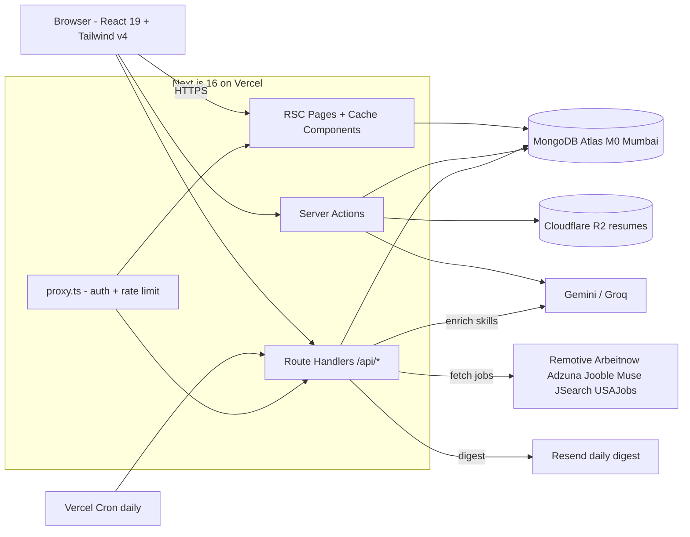

# JobScope — Build Plan (Phases 1–7)

All env keys in [.env](.env) are already provisioned (MongoDB, Google OAuth, Gemini, Groq, Adzuna, Jooble, RapidAPI, Resend, R2). We can start coding immediately on `pnpm` + Next.js 16.2 + React 19.

## 0. Locked Decisions (deviations / picks from SRS options)

- Auth: **Better Auth v1** with `mongodbAdapter` + email/password + Google OAuth + Resend-powered email verification.
- DB driver: **Mongoose v8** (one shared `lib/db.ts` connection cache, fits Vercel serverless via `mongoose.connection.readyState` guard).
- Storage: **Cloudflare R2** via `@aws-sdk/client-s3` (env already has `R2_ENDPOINT`, `R2_BUCKET_NAME`, keys, account id).
- LLM: **Gemini Flash** primary (`@google/generative-ai`), **Groq** fallback (`groq-sdk`) for resume parse and AI helpers.
- Tooling: **pnpm**, **Biome v2** (single tool for lint+format), **Vitest** + **Playwright**.
- Tailwind: **v4 CSS-first** — no `tailwind.config.ts`, all tokens in `app/globals.css` `@theme` block, OKLCH colors, `@custom-variant dark`.
- Next.js 16 specifics: `proxy.ts` (not middleware.ts), async `params`/`searchParams`/`cookies()`/`headers()`, Cache Components on (`cacheComponents: true`) so the dashboard can ship a static shell + cached job grid + dynamic per-user score stripe.
- Aesthetic direction: SRS's "Linear ✕ Notion ✕ Vercel" — calm, type-driven, dense. Single bold accent (electric indigo `oklch(0.65 0.18 260)`), Geist Sans + Geist Mono throughout, motion only on score donuts, Kanban drags, and route transitions.

## 1. Repo & Project Setup

```bash
pnpm create next-app@latest . --ts --tailwind --app --turbopack --import-alias "@/*"
pnpm add better-auth mongoose @aws-sdk/client-s3 @aws-sdk/s3-request-presigner \
  @google/generative-ai groq-sdk resend zod @t3-oss/env-nextjs \
  pdf-parse mammoth @dnd-kit/core @dnd-kit/sortable cmdk \
  motion lucide-react sonner next-themes class-variance-authority \
  clsx tailwind-merge
pnpm add -D @biomejs/biome vitest @vitest/coverage-v8 @testing-library/react \
  @playwright/test @types/pdf-parse
pnpm dlx shadcn@latest init   # pick "New York", base color "Neutral", CSS variables yes
```

Folder layout (mirrors §13 of SRS):

```
app/
  (marketing)/page.tsx, pricing/page.tsx
  (auth)/login, signup, verify, forgot-password
  (app)/dashboard, jobs/[id], resumes, resumes/[id], applications, settings/{profile,preferences,account}
  api/
    auth/[...all]/route.ts        # Better Auth handler
    resumes/...
    jobs/...
    applications/...
    ai/{cover-letter,skill-gap,interview-prep}/route.ts
    cron/{fetch-jobs,send-alerts}/route.ts
  globals.css                     # Tailwind v4 @theme tokens
  layout.tsx
proxy.ts                          # auth gate + rate limit (Next.js 16)
lib/
  db.ts                           # Mongoose singleton
  auth.ts, auth-client.ts         # Better Auth server + client
  env.ts                          # zod-validated env (@t3-oss/env-nextjs)
  r2.ts                           # S3 client + presign helpers
  llm/{gemini.ts,groq.ts,prompts.ts}
  jobs/adapters/{remotive,arbeitnow,adzuna,jooble,muse,jsearch,usajobs}.ts
  jobs/{normalize.ts,dedupe.ts,enrich.ts}
  match/{score.ts,location.ts,seniority.ts}
  resume/{extract.ts,parse.ts,schema.ts}
  rate-limit.ts                   # in-memory LRU now, Upstash later
  utils.ts                        # cn(), formatters
models/
  user.ts, resume.ts, job.ts, application.ts, match.ts
components/
  ui/*                            # shadcn
  marketing/*, app/*              # custom
vercel.json                       # cron schedules
```

## 2. Architecture Snapshot



## 3. Cross-Cutting Conventions (apply everywhere)

- **Validation:** `zod` schemas at every boundary (form input, server action arg, API body, LLM response). Infer types with `z.infer`.
- **Response envelope:** `{ ok: true, data } | { ok: false, error: { code, message } }`. Codes: `UNAUTHORIZED | RATE_LIMITED | VALIDATION | NOT_FOUND | INTERNAL`.
- **Server vs Client:** RSC by default. Add `'use client'` only for interactivity (forms, dnd-kit, theme toggle, cmdk). Never mark a component async + client.
- **Async APIs (Next 16):** every `params`, `searchParams`, `cookies()`, `headers()` is `await`ed.
- **Caching:** wrap pure DB reads with `'use cache'` + `cacheTag('jobs')` / `cacheTag('user-{id}-resumes')`. Mutations call `revalidateTag` (background) or `updateTag` (same-request fresh read).
- **Errors:** every `(app)` segment has `error.tsx` + `loading.tsx`; root has `not-found.tsx` and `global-error.tsx`.
- **Bundling:** dynamic-import `pdf-parse`, dnd-kit Kanban, and the rich-text job description renderer; never barrel-import `lucide-react`.
- **PII safety:** `lib/llm/redact.ts` strips emails/phone numbers before any LLM call; assert no PII in any `console.*`.

## 4. Phase 1 — Foundation (Days 1–3)

1. **Scaffold + tooling:** `pnpm create next-app`, enable `cacheComponents: true` in [next.config.ts](next.config.ts), Biome init, Vitest + Playwright skeleton, GitHub repo + Vercel project link.
2. **Env validation** in `lib/env.ts` with `@t3-oss/env-nextjs` mirroring [.env](.env) keys; fail-fast at boot.
3. **Tailwind v4 theme** in [app/globals.css](app/globals.css):
   ```css
   @import "tailwindcss";
   @custom-variant dark (&:where(.dark, .dark *));
   @theme {
     --color-bg: oklch(0.99 0 0);
     --color-fg: oklch(0.15 0 0);
     --color-fg-muted: oklch(0.45 0 0);
     --color-border: oklch(0.92 0 0);
     --color-accent: oklch(0.65 0.18 260);
     --color-success: oklch(0.7 0.17 145);
     --color-warning: oklch(0.78 0.15 75);
     --color-danger: oklch(0.62 0.22 25);
     --radius-card: 12px;
     --shadow-soft: 0 1px 2px rgb(0 0 0 / 0.04), 0 8px 24px rgb(0 0 0 / 0.06);
   }
   .dark {
     --color-bg: oklch(0.13 0 0);
     --color-fg: oklch(0.96 0 0); /* ... */
   }
   ```
4. **shadcn/ui base** (`button`, `input`, `label`, `card`, `dialog`, `dropdown-menu`, `tabs`, `toast` via Sonner, `avatar`, `tooltip`, `separator`, `skeleton`).
5. **MongoDB connection** in `lib/db.ts` with global cache pattern + register all Mongoose models.
6. **Better Auth** in `lib/auth.ts`:
   ```ts
   import { betterAuth } from "better-auth";
   import { mongodbAdapter } from "better-auth/adapters/mongodb";
   import { Resend } from "resend";
   const resend = new Resend(env.RESEND_API_KEY);
   export const auth = betterAuth({
     database: mongodbAdapter(mongoClient.db()),
     emailAndPassword: {
       enabled: true,
       requireEmailVerification: true,
       sendVerificationEmail: async ({ user, url }) =>
         resend.emails.send({
           from: env.EMAIL_FROM,
           to: user.email,
           subject: "Verify your JobScope email",
           html: verifyTemplate(url),
         }),
     },
     socialProviders: {
       google: {
         clientId: env.AUTH_GOOGLE_ID,
         clientSecret: env.AUTH_GOOGLE_SECRET,
       },
     },
     session: { expiresIn: 60 * 60 * 24 * 30 },
     trustedOrigins: [env.NEXT_PUBLIC_APP_URL],
   });
   ```
   Plus `lib/auth-client.ts` (`createAuthClient`) and [app/api/auth/[...all]/route.ts](app/api/auth/[...all]/route.ts) (`toNextJsHandler(auth)`).
7. **proxy.ts** at repo root — calls `auth.api.getSession({ headers: await headers() })`, redirects unauth'd users hitting `(app)` group to `/login`, runs IP-based LRU rate-limit (60 req/min) on `/api/*`.
8. **Layouts:** root `app/layout.tsx` (Geist Sans + Geist Mono via `next/font/google`, ThemeProvider, Sonner, metadata defaults), `(app)/layout.tsx` (collapsible `SidebarNav`, top bar with user dropdown + ⌘K opener).
9. **Auth pages:** `/login`, `/signup`, `/verify`, `/forgot-password` — `react-hook-form` + `zod` + Better Auth client calls; minimal split-screen layout with the accent color used as a single hairline.

**Exit criteria:** sign up via email or Google, verify email, login, logout, hit `/dashboard` (empty state), Lighthouse on `/login` ≥ 95.

## 5. Phase 2 — Resume Pipeline (Days 4–6)

1. **`models/resume.ts`** matches §6.2 of SRS, with `parsed` sub-schema and `text index` on `parsed.skills.*`.
2. **R2 client** in `lib/r2.ts` using `@aws-sdk/client-s3` against `R2_ENDPOINT`; helpers `putResume(buffer, userId)` and `getSignedDownloadUrl(key)`.
3. **Upload Server Action** in `app/(app)/resumes/actions.ts`:
   - Validate MIME (`application/pdf | vnd.openxmlformats-...wordprocessingml.document`) and size ≤ 5 MB.
   - Upload to R2 → `r2://jobscope-resumes/{userId}/{uuid}.pdf`.
   - Extract text with `pdf-parse` (PDF) or `mammoth` (DOCX).
   - Redact PII → call Gemini Flash with strict JSON schema prompt → validate with `ResumeSchema` (Zod). On invalid: one retry with stricter prompt, then Groq fallback (Llama-3.3-70B), then regex fallback.
   - Persist to `resumes` collection, return parsed object.
4. **Resume UI:**
   - `/resumes` — drag-drop uploader (`react-dropzone`-free implementation using native HTML5 + dashed border with `@starting-style` animation), list of resumes with active toggle.
   - `/resumes/[id]` — editable parsed view: skills as removable chips (Geist Mono), inline-editable experience entries, "Make active" pill in header. Save via Server Action → `updateTag('resumes')`.
5. **ATS score** (FR-AI-5) computed locally in `lib/resume/ats.ts` (heuristics: contact present, action verbs present, length, keyword density vs resume's own skills) and shown as a small donut in the header.

**Exit criteria:** upload 10 sample resumes, ≥ 90% field accuracy on manual review, parse < 8s p95 with progress indicator (Suspense + skeleton).

## 6. Phase 3 — Job Aggregation (Days 7–9)

1. **`models/job.ts`** per §6.3, indexes: `{externalId,source}` unique, `dedupeHash`, `postedAt`, `extractedSkills`, plus a TTL index expiring 45 days after `fetchedAt` (storage cap mitigation).
2. **Adapters** in `lib/jobs/adapters/*.ts` — each exports `{ fetch(), normalize(raw) }` to a unified shape. Order of build: Remotive → Arbeitnow → The Muse → USAJobs (no auth) → Adzuna (`country=in,gb,us`) → Jooble → JSearch.
3. **`lib/jobs/dedupe.ts`** — SHA-256 of `${title}|${company}|${city}` lowercase, prefer the most-recent `postedAt` if collision, store `source` on collision array.
4. **Skill enrichment** in `lib/jobs/enrich.ts`: regex-match against `data/skills-dictionary.ts` (~600 curated skills) for every job (cheap), then send the top 100 newest unenriched JDs of the day to Gemini in batches of 10 for fuzzy skill discovery.
5. **Cron route** [app/api/cron/fetch-jobs/route.ts](app/api/cron/fetch-jobs/route.ts):
   - Auth: header `Authorization: Bearer ${env.CRON_SECRET}`.
   - `runtime = 'nodejs'`, `maxDuration = 60`.
   - Loops adapters with per-source try/catch (one failure does not kill cron).
   - Calls `revalidateTag('jobs')` at end so the dashboard recomputes on next view.
6. **`vercel.json`:**
   ```json
   {
     "crons": [
       { "path": "/api/cron/fetch-jobs", "schedule": "30 21 * * *" },
       { "path": "/api/cron/send-alerts", "schedule": "30 03 * * *" }
     ]
   }
   ```
7. **Manual refresh** — `/api/jobs/refresh` server action gated to once-per-hour-per-user via `lib/rate-limit.ts`.

**Exit criteria:** ≥ 500 unique deduplicated non-expired jobs from ≥ 4 sources after first cron run; manual run via dev endpoint completes < 60s.

## 7. Phase 4 — Matching & Dashboard (Days 10–12)

1. **`lib/match/score.ts`** implements the 50/20/15/10/5 algorithm from §10 verbatim, exported as `score(resume, job, prefs)` returning `{ score, breakdown, matchedSkills, missingSkills }`. Helpers `seniority.ts` (adjacency table) and `location.ts` (city + country normalize).
2. **Match cache:** on dashboard load, derive scores in a `'use cache' + cacheLife({ revalidate: 3600 }) + cacheTag('matches-{userId}-{resumeId}')` function keyed by `(userId, resumeId, jobIdsHash)`. Persist top 200 to `matches` collection with TTL = 7 days.
3. **Dashboard** [app/(app)/dashboard/page.tsx](<app/(app)/dashboard/page.tsx>) — Cache Components in action:
   - Static shell (header, sidebar, filter bar skeleton) prerendered.
   - `<JobGrid>` is `'use cache'` keyed by sorted query params (filters, search, page).
   - `<ScoreStripe>` (the user's per-job score donut overlay) is in a `<Suspense>` because it needs the active resume.
4. **JobCard component** — title, company, location, salary, top 5 skill chips (matched green / missing gray), animated `ScoreDonut` (SVG `stroke-dasharray` + Motion `animate` from 0 → score on mount), save/dismiss/apply buttons. Hover: subtle elevation via `--shadow-soft`.
5. **Filters & search** — controlled via URL params (`/dashboard?remote=1&seniority=mid&q=react`); stays SSR-friendly. Search uses Mongo `$text` index on `title|company|description`.
6. **Job detail** `/jobs/[id]` — full JD, match breakdown radial chart (SVG), apply CTA, AI helper buttons (cover letter / skill gap / interview prep) deferred behind dialogs.

**Exit criteria:** scores feel reasonable on 20 hand-checked jobs; filters + search persist via URL; LCP ≤ 1.5s on 4G throttling.

## 8. Phase 5 — Tracker & AI (Days 13–15)

1. **Application Kanban** `/applications` — `@dnd-kit/core` + `@dnd-kit/sortable`, columns Saved / Applied / Interview / Offer / Rejected. Drag persists via Server Action that updates `applications.status`. Animations via Motion `layoutId`.
2. **Per-card sheet** — notes (`textarea`), application date, reminder date (uses `after()` to schedule a Resend reminder email).
3. **Stats widget** — week-over-week applications, response rate, avg time-to-response; one Mongo `$facet` aggregation.
4. **AI helpers** (Server Actions, all hit Gemini → Groq fallback):
   - **Cover letter** `/api/ai/cover-letter` — input: `{jobId, resumeId}`. Returns markdown letter, streams via `experimental_StreamingTextResponse`.
   - **Skill gap** — returns `{ have: string[], missing: string[], resources: { skill, link }[] }` (resources from a curated map).
   - **Interview prep** — 10 questions categorized (technical/behavioral/role-specific).
   - **ATS score** — already built in Phase 2; surfaced here as a per-resume card.

**Exit criteria:** drag persists across reload; cover letter generates in < 10s; AI calls strip PII (verified by unit test on `lib/llm/redact.ts`).

## 9. Phase 6 — Alerts & Polish (Days 16–18)

1. **Daily digest cron** [app/api/cron/send-alerts/route.ts](app/api/cron/send-alerts/route.ts) — for each user with `alertFrequency != 'off'`, compute matches, take top 5 with score ≥ 75, render React Email template, send via Resend (already in `EMAIL_FROM=mail@aniketpandey.website`). Skip if user has no active resume.
2. **Settings pages:** profile (name, avatar via R2 + signed URL), preferences (target roles, locations, work mode, salary min, alert freq + time + tz), account (change password, delete account → wipes `users`, `resumes`, `applications`, `matches` and purges R2 keys).
3. **Empty states & skeletons** — every list view has a designed empty state (illustration via inline SVG, CTA), every async boundary has a skeleton.
4. **A11y pass** — keyboard-nav every flow, `aria-live` on toasts, focus rings via `focusRing` util, `prefers-reduced-motion` honored.
5. **Performance pass** — Lighthouse on `/`, `/login`, `/dashboard`. Tune: `next/image` for OG/avatars, `next/font` already used, audit bundle with `next experimental-analyze`.
6. **OWASP/security pass** — CSP via `proxy.ts` headers, secure+httpOnly cookies (Better Auth defaults), rate-limit verified, Mongo input validated by Zod everywhere, file-upload MIME re-checked server-side.

**Exit criteria:** all 10 acceptance items in §16 of SRS pass; Lighthouse ≥ 90 perf, ≥ 95 a11y on landing + dashboard.

## 10. Phase 7 — Ship (Day 19+)

1. Push to GitHub, connect Vercel project, set all env vars from [.env](.env) in Vercel dashboard (Production + Preview).
2. MongoDB Atlas: confirm Mumbai region cluster, IP allowlist `0.0.0.0/0` (Vercel egress IPs aren't static on Hobby).
3. Cron secrets: rotate `CRON_SECRET`, paste into Vercel env, verify cron history page logs success.
4. Domain: attach `jobscope-web.vercel.app` (already in `NEXT_PUBLIC_APP_URL`) or custom; add to Better Auth `trustedOrigins` and Google OAuth authorized redirect URIs.
5. Observability: enable Vercel Analytics + Speed Insights; add Sentry free tier (`@sentry/nextjs`) with PII scrubbing.
6. README: project intro, env table, local-dev instructions (`pnpm dev`, sample resume to upload, `curl -H "Authorization: Bearer $CRON_SECRET" /api/cron/fetch-jobs` to seed data).

## 11. Risk Register (active mitigations baked into the plan)

- **Atlas 512 MB cap** → 45-day TTL on `jobs`, only enrich top 100 daily, periodic compact via cron.
- **Gemini 1M tokens/day** → Groq fallback wired from day 1; resume-parse output cached to `resumes.parsed` so re-parse never auto-runs.
- **Vercel Hobby cron limits (1/day, 60s)** → split fetch-jobs into one cron that fans out adapters in parallel with `Promise.allSettled` and per-source 8s timeout; if we outgrow this, swap to Upstash QStash without changing code.
- **LinkedIn/Indeed coverage gap for India** → Adzuna `country=in` + Jooble + JSearch (RapidAPI) cover it within free tiers.
- **Process-memory rate limit on serverless** → fine for hobby scale; documented swap to Upstash Redis when we approach >1 instance.

## 12. Test Strategy

- **Unit (Vitest):** `score.ts`, `dedupe.ts`, `redact.ts`, every adapter `normalize()`, ATS heuristics.
- **Integration:** mock Gemini → run resume parser end-to-end on 5 fixtures; mock job APIs → run cron handler.
- **E2E (Playwright):** signup → verify (intercept Resend) → upload resume → see parsed → see ranked dashboard → save job → drag in Kanban → log out.
- **CI:** GitHub Actions on PR — `biome ci`, `pnpm test`, `pnpm playwright test`, `pnpm build`.
